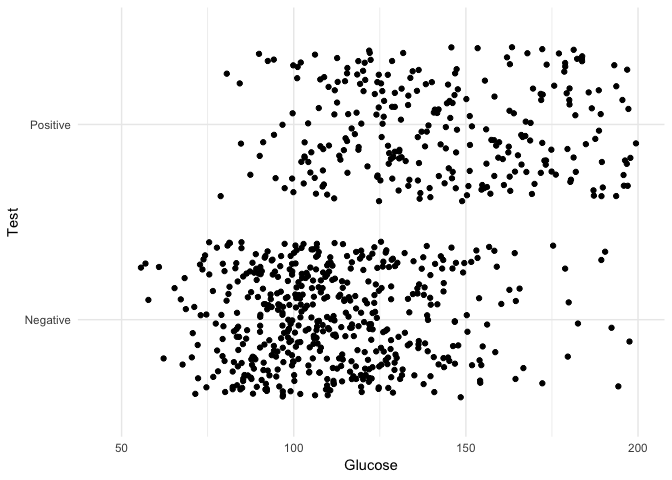

Data Analysis Project - The case of Diabetes on Pima Indians
================
Said Jiménez

Setup
-----

``` r
library(rjags)
library(caret)
library(faraway)
library(caTools)
library(GGally)
library(tidyverse)
```

Abstract
--------

Two Bayesian logistic models are presented to classify the results of a diabetes test in a group of 768 Indian women. Both models use different health indicators as predictors, but vary in the number of features used. The Deviance Information Criterion (DIC) was used to determined which of the two models were the most useful and the selected model was used to predict the test's results of all women evaluated. The comparison between the actual diagnoses and predictions indicates adequate predictive capacity of the model.

Introduction
------------

Diabetes is a chronic disease in which the body is not able to regulate the amount of sugar in the blood. The methods of diagnosis involve the measurement of glucose, however there are several health indicators that could help to have a more accurate diagnosis. The purpose of this paper is to compare the classification power of two models, one involving different health indicators and other that includes just two predictors: glucose and body mass index. Therefore, the research question is:

> Which of two statistical models allows a better classification? The model that includes different health indicators or the one which only includes glucose and BMI?

Data
----

Data are derived from a study conducted by the National Institute of Diabetes and Kidney Digestive Diseases. It includes measurements of 768 adult Indian Pima women, living near Phoenix, its variables are: number of pregnancies glucose, diastolic pressure, triceps skin thickness, insulin level, body mass index, diabetes pedigree function, age and results of a test that indicates if the patient shows signs of diabetes. [Data](http://archive.ics.uci.edu/ml/datasets/Pima+Indians+Diabetes) are free and can be consulted in the repository for Machine Learning of the UCI.

We center and scale the data to make the measurements comparable and to use the same prior for the predictors in the next section. Here are shown the first six cases:

    ##     pregnant    glucose  diastolic    triceps    insulin        bmi
    ## 1  0.6395305  0.8477713  0.1495433  0.9066791 -0.6924393  0.2038799
    ## 2 -0.8443348 -1.1226647 -0.1604412  0.5305558 -0.6924393 -0.6839762
    ## 3  1.2330766  1.9424580 -0.2637694 -1.2873733 -0.6924393 -1.1025370
    ## 4 -0.8443348 -0.9975577 -0.1604412  0.1544326  0.1232213 -0.4937213
    ## 5 -1.1411079  0.5037269 -1.5037073  0.9066791  0.7653372  1.4088275
    ## 6  0.3427574 -0.1530851  0.2528715 -1.2873733 -0.6924393 -0.8108128
    ##     diabetes         age
    ## 1  0.4681869  1.42506672
    ## 2 -0.3648230 -0.19054773
    ## 3  0.6040037 -0.10551539
    ## 4 -0.9201630 -1.04087112
    ## 5  5.4813370 -0.02048305
    ## 6 -0.8175458 -0.27558007

Here is depicted the relationship between glucose levels and test results, in general, it is seen that there are more people who are negative in the diabetes test, but as glucose increases the positive ones also increases.



Model
-----

Two logistic models were used to classify the results of the diabetes test. A complete model that included all available predictors in the database. And, in the other hand, a reduced model, which only used predictors: glucose and BMI. The specifications of the complete model are shown in the JAGS code below:

``` r
# String model in JAGS
mod_string <- "model {
  # Likelihood Bernoulli
  for (i in 1:length(y)) {
    y[i] ~ dbern(p[i])
    
    logit(p[i]) = int + b[1]*pregnant[i] + 
      b[2]*glucose[i] + b[3]*diastolic[i] +
      b[4]*triceps[i] + b[5]*insulin[i] + 
      b[6]*bmi[i] + b[7]*diabetes[i] +
      b[8]*age[i]
  }

  # Prior for the intercept
  int ~ dnorm(0.0, 1.0/25.0)
  
  # Informative prior for predictors
  for (j in 1:8) {
    b[j] ~ ddexp(0.0, sqrt(2.0)) # variance of 1
  }
}"
```

### Complete Model

We first fit the complete model with three Markov Chains and we run it for 5,000 iterations. Later, the convergence diagnoses were performed and checked, they did not show problems in autocorrelation and had an effective sample size of several thousand simulations, so we concluded that there were no problems of convergence.

### Reduced Model

In the other hand, the reduced model consisted of the same specifications as the full model, except that only the variables: glucose and BMI were selected. The decision of choose these two predictors was made based on theory and results of the complete model, which seem to support the main contribution of these two features on the diagnosis. We fit and checked the model in the same way of the complete model, convergence diagnoses did not show any problem.

Results
-------

### Complete Model

The complete model indicates that the variables: pregnancy, glucose, BMI, and diabetes pedigree function increases the probability of being positive en diabetes test. While the predictors diastolic pressure and insulin decreases this probability. The most important predictors are glucose and BMI. The following are the means of the combines samples of the three simulated chains, as well as the DIC:

    ##         b[1]         b[2]         b[3]         b[4]         b[5] 
    ##  0.404652917  1.116190344 -0.235290098  0.006325843 -0.122307493 
    ##         b[6]         b[7]         b[8]          int 
    ##  0.692672971  0.301597113  0.169890721 -0.869151403

    ## Mean deviance:  732.4 
    ## penalty 8.903 
    ## Penalized deviance: 741.3

### Reduced Model

The reduced model was run including only the glucose and BMI predictors, then the DIC and the means of the combined simulations were calculated:

    ##       b[1]       b[2]        int 
    ##  1.1178346  0.5933320 -0.8206182

    ## Mean deviance:  774.5 
    ## penalty 3.106 
    ## Penalized deviance: 777.6

The comparison of the two models in the DIC indicates preference for the complete model, reason why it was decided to use this model to make predictions and to compare it with the real data.

    ## Confusion Matrix and Statistics
    ## 
    ##           Reference
    ## Prediction   0   1
    ##          0 445 111
    ##          1  55 157
    ##                                          
    ##                Accuracy : 0.7839         
    ##                  95% CI : (0.753, 0.8125)
    ##     No Information Rate : 0.651          
    ##     P-Value [Acc > NIR] : 7.051e-16      
    ##                                          
    ##                   Kappa : 0.5001         
    ##  Mcnemar's Test P-Value : 1.965e-05      
    ##                                          
    ##             Sensitivity : 0.5858         
    ##             Specificity : 0.8900         
    ##          Pos Pred Value : 0.7406         
    ##          Neg Pred Value : 0.8004         
    ##              Prevalence : 0.3490         
    ##          Detection Rate : 0.2044         
    ##    Detection Prevalence : 0.2760         
    ##       Balanced Accuracy : 0.7379         
    ##                                          
    ##        'Positive' Class : 1              
    ## 

The table above shows the analysis of the classification of the complete model versus the actual data, it indicates that the model has an accuracy of 78%, although the accuracy result is adequate and the specificity also is (89%), the sensitivity of the prediction indicates that it is not the best model (58%).

Conclusions
-----------

The complete model suggests that other variables besides glucose and BMI may be useful in diagnostic accuracy. It would be worth exploring other combinations of the predictors that could have greater predictive power and at the same time be simpler than the complete model.

The present study raises considerations for the diagnosis of people with diabetes, it suggests that although glucose and BMI are fundamental variables for the diagnosis, there are some other indicators that in an additive way can help to increase the precision in the detection of this problem.
